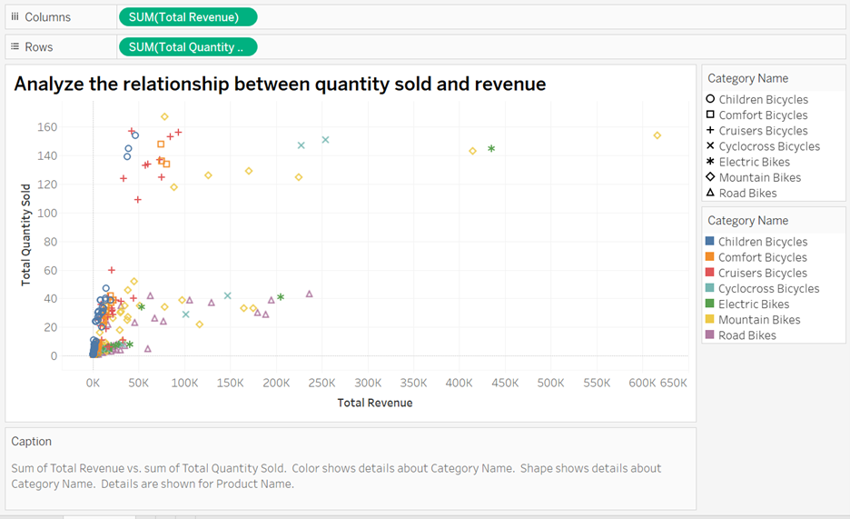
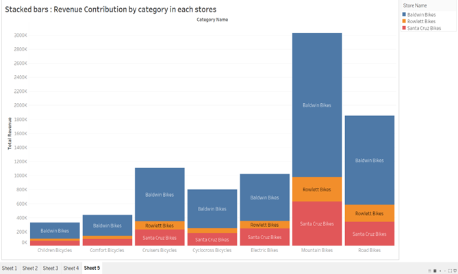

# Tableau Quantity Sold and Revenue Analysis

This repository contains SQL queries, Tableau workbooks, and visualization examples for analyzing the relationship between **Quantity Sold** and **Revenue**.

## Overview

The goal of this project is to explore business insights using Tableau visualizations, such as:
- Revenue Contribution by Category and Store
- Top Products by Quantity Sold
- Comparison of Revenue vs. Quantity Sold

## Visualizations

The following visualizations are included in the analysis:
1. **Scatter Plot**: Relationship between Total Quantity Sold and Total Revenue.
2. **Dual-Axis Bar Chart**: Comparison of Total Quantity Sold and Total Revenue.
3. **Stacked Bar Chart**: Revenue contribution by category and store.
4. **Heat Map**: Store and category performance in terms of revenue.
5. **Bubble Chart**: Overall product and category performance.

## SQL Queries

The dataset was prepared using the following SQL queries:

```sql
-- Total quantity sold and revenue by category and store
SELECT 
    p.product_name,
    SUM(oi.quantity) AS TotalQuantitySold,
    SUM((oi.list_price * oi.quantity) - oi.discount) AS TotalRevenue,
    c.category_name,
    b.brand_name,
    s.store_name
FROM sales.order_items oi
JOIN production.products p ON oi.product_id = p.product_id
JOIN production.categories c ON p.category_id = c.category_id
JOIN production.brands b ON p.brand_id = b.brand_id
JOIN sales.orders o ON oi.order_id = o.order_id
JOIN sales.stores s ON o.store_id = s.store_id
GROUP BY p.product_name, c.category_name, b.brand_name, s.store_name
ORDER BY TotalQuantitySold DESC, TotalRevenue DESC;
```

## Files Included

- `visualizations.twbx`: Tableau workbook with visualizations.
- `queries.sql`: SQL script for preparing the dataset.
- Example screenshots of Tableau visualizations.

## Getting Started

1. Clone the repository:
   ```bash
   git clone https://github.com/your-username/Tableau_Quantity_Revenue_Analysis.git
   cd Tableau_Quantity_Revenue_Analysis
   ```

2. Open the Tableau workbook:
   - Install Tableau Public or Tableau Desktop.
   - Open the `visualizations.twbx` file to view or modify visualizations.
   - Open the Tableau public link as well : 
   https://public.tableau.com/app/profile/m.m4636/viz/DataVisualization_17322168221080/Dashboard2?publish=yes


3. Use the SQL queries to prepare your dataset.

## Example Visualizations

### 1. Scatter Plot: Quantity vs. Revenue


### 2. Stacked Bar Chart: Revenue by Store and Category


---

## Contributing

Feel free to contribute by:
- Adding more visualizations.
- Improving SQL queries for dataset preparation.

---

## License

This project is licensed under the MIT License.
